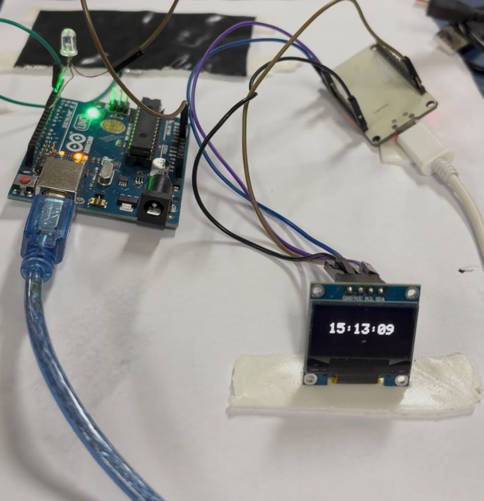
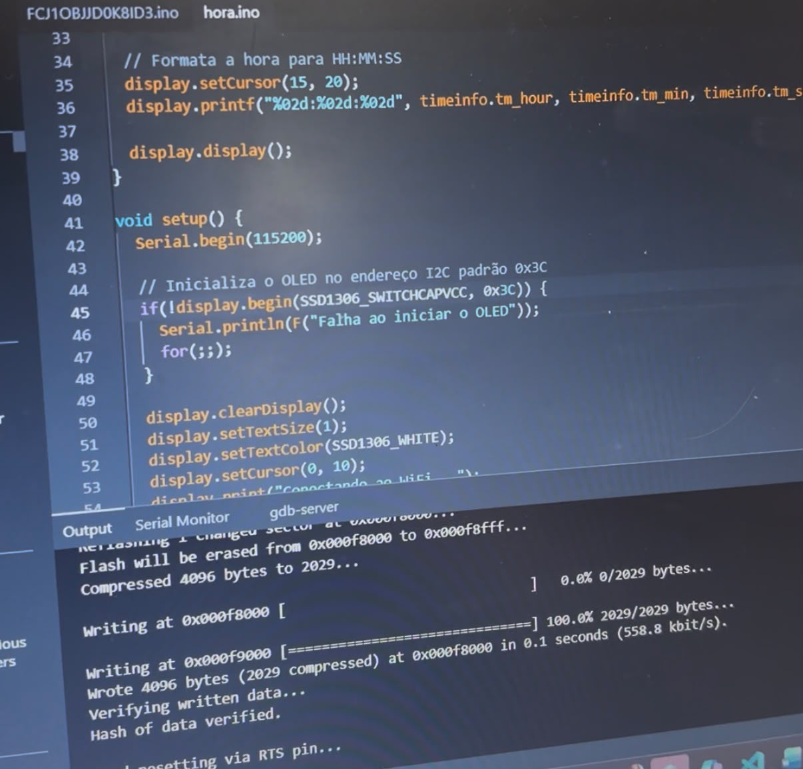
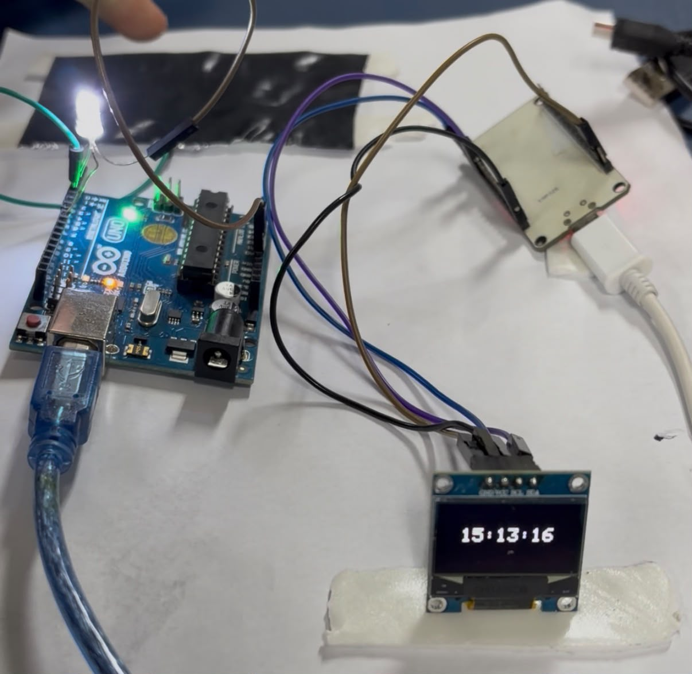
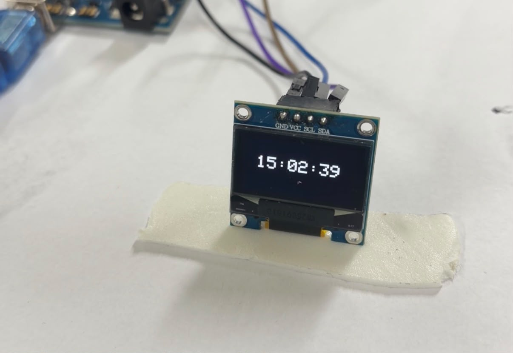
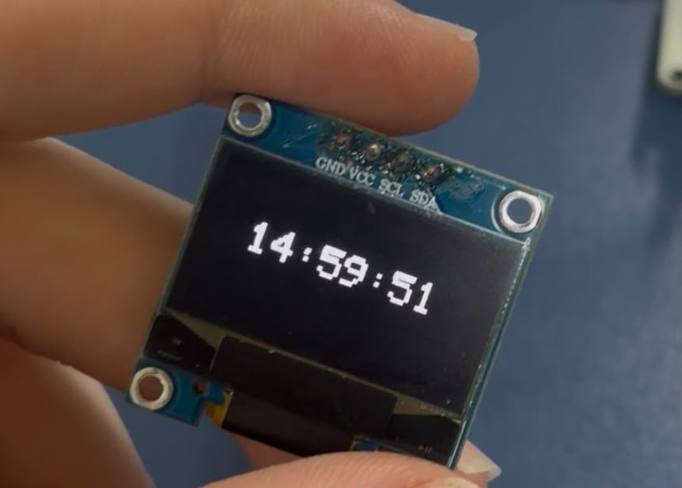

# 🛏️ Estação de Cabeceira Inteligente

> Relógio digital de alta precisão (sincronizado via internet) com abajur acionado por toque capacitivo, construído sobre o microcontrolador **ESP32**.


Projeto desenvolvido para a disciplina de **Pensamento Computacional** (Turma SIS1), aplicando os quatro pilares fundamentais — decomposição, reconhecimento de padrões, abstração e algoritmo — na resolução de um problema real de automação residencial.

<p align="center">
  
  <br>
  <sub>Protótipo em funcionamento: relógio sincronizado e circuito sensitivo montados.</sub>
</p>

---

## 📑 Sumário

- [Visão geral](#-visão-geral)
- [O problema](#-o-problema)
- [Funcionalidades](#-funcionalidades)
- [Hardware utilizado](#-hardware-utilizado)
- [Pinagem (Wiring)](#-pinagem-wiring)
- [Dependências de software](#-dependências-de-software)
- [Como configurar e gravar](#-como-configurar-e-gravar)
- [Aplicação do Pensamento Computacional](#-aplicação-do-pensamento-computacional)
- [Algoritmo da solução](#-algoritmo-da-solução)
- [Testes e troubleshooting](#-testes-e-troubleshooting)
- [Galeria do protótipo](#-galeria-do-protótipo)
- [Melhorias futuras](#-melhorias-futuras)
- [Conclusão](#-conclusão)
- [Autor](#-autor)

---

## 🔍 Visão geral

A **Estação de Cabeceira Inteligente** é um dispositivo compacto que une dois recursos numa única placa:

1. Um **relógio digital autônomo** que busca a hora exata na internet via protocolo **NTP** e a exibe numa tela **OLED**, sem nunca precisar de ajuste manual.
2. Uma **lâmpada de abajur sensitiva**, acionada por **toque capacitivo** em qualquer parte condutiva da estrutura — dispensando interruptores mecânicos.

Todo o processamento (rede, leitura de sensor e escrita no display) roda simultaneamente em um único microcontrolador ESP32, mantendo o custo baixo.

---

## 🎯 O problema

O projeto nasceu da observação de duas inconveniências comuns em ambientes de quarto à noite:

- **Relógios de cabeceira que se desconfiguram** e atrasam a cada queda de energia, exigindo reajuste constante.
- **Dificuldade de encontrar interruptores pequenos no escuro** para acender abajures tradicionais.

A solução é especialmente útil para idosos e pessoas com mobilidade reduzida, que têm dificuldade em manusear pequenos interruptores no escuro.

---

## ✨ Funcionalidades

- ⏰ **Relógio sincronizado via NTP** — precisão de milissegundos, fuso horário de Brasília (GMT-3).
- 📺 **Exibição em OLED** — horário no formato `HH:MM:SS` atualizado a cada 1 segundo, legível no escuro.
- 👆 **Acionamento por toque capacitivo** — liga/desliga a lâmpada ao tocar a superfície condutiva.
- 🛡️ **Debounce** — evita acionamentos múltiplos indesejados em um único toque.
- 📶 **Reconexão automática de Wi-Fi** — o relógio continua funcionando mesmo se a rede oscilar.

---

## 🔧 Hardware utilizado

| Componente | Especificação | Função |
|---|---|---|
| Microcontrolador | NodeMCU **ESP32** (30 pinos) | Processamento, Wi-Fi e leitura capacitiva |
| Display | **OLED SSD1306** 0.96" (128×64), monocromático | Exibição do horário |
| Sensor | Pino *touch* nativo do ESP32 + malha metálica condutiva | Detecção de toque no abajur |
| Atuação | Lâmpada do abajur + circuito de chaveamento | Carga controlada |
| Conexões | Cabos *jumper* | Ligações do barramento I2C |

---

## 🔌 Pinagem (Wiring)

| Sinal | Pino do ESP32 | Observação |
|---|---|---|
| SDA (I2C – dados) | **GPIO 21** | Barramento do display OLED |
| SCL (I2C – clock) | **GPIO 22** | Barramento do display OLED |
| Endereço I2C do OLED | `0x3C` | Padrão do SSD1306 |
| Pino *touch* | Pino sensível ao toque | Conectado à malha condutiva do abajur |
| Saída da lâmpada | GPIO de saída digital | Aciona o circuito de potência |

> ⚠️ **Atenção:** o mau contato nos jumpers do barramento I2C foi a principal causa de falha durante a montagem. Verifique firmemente os encaixes de SDA/SCL.

---

## 📦 Dependências de software

- [Arduino IDE](https://www.arduino.cc/en/software)
- **Pacote de placas ESP32** (Espressif) — instalado pelo *Boards Manager*
- Biblioteca **Adafruit_GFX**
- Biblioteca **Adafruit_SSD1306**

---

## ⚙️ Como configurar e gravar

1. Instale o pacote de placas **esp32** da Espressif no *Boards Manager* da Arduino IDE.
2. Instale as bibliotecas **Adafruit_GFX** e **Adafruit_SSD1306** pelo *Library Manager*.
3. Abra o sketch e edite suas credenciais de rede:
   ```cpp
   const char* ssid     = "SUA_REDE_WIFI";
   const char* password = "SUA_SENHA";
   ```
4. Selecione a placa **ESP32 Dev Module** e a porta serial correspondente (ex.: `COM3`).
5. **Reduza o *Upload Speed* para `115200` bps** para evitar erros de `Write timeout`.
6. Compile e grave (*Upload*).

<p align="center">
  
  <br>
  <sub>Trecho do código na Arduino IDE: inicialização do display OLED (0x3C) e gravação concluída com sucesso.</sub>
</p>

---

## 🧠 Aplicação do Pensamento Computacional

### 1. Decomposição
O problema foi dividido em **5 módulos** menores e independentes:

1. **Conectividade** — inicialização do Wi-Fi e autenticação na rede.
2. **Sincronização temporal** — comunicação NTP (`pool.ntp.org`) e aplicação do fuso (-10800 s).
3. **Interface visual** — inicialização do OLED via I2C e formatação do texto.
4. **Sensoriamento de toque** — varredura e filtragem das variações eletrostáticas no pino *touch*.
5. **Atuação/potência** — chaveamento da saída digital que alimenta a lâmpada.

### 2. Reconhecimento de padrões
- **Ciclos temporais:** a tela é atualizada num padrão fixo e periódico de **1000 ms**.
- **Reaproveitamento de sintaxe:** o formato de dois dígitos com zero à esquerda (`%02d`) é o mesmo para horas, minutos e segundos.
- **Fluxo linear de boot:** Energia → Inicializar periféricos → Wi-Fi → NTP, sempre nessa ordem obrigatória.

### 3. Abstração
| Mantido (essencial) | Omitido nesta versão |
|---|---|
| Conexão de rede estável | Menus complexos na tela |
| Precisão cronometrada no OLED | Ajuste manual por botões |
| Responsividade do toque | Efeitos de transição e dimerização |

### 4. Algoritmo
Ver a seção dedicada abaixo. ⬇️

---

## 📜 Algoritmo da solução

```text
Algoritmo EstacaoCabeceiraInteligente

  Definir credenciais_wifi
  Definir fuso_horario = -10800 segundos (GMT-3)
  Definir limite_touch  = 20

  Procedimento setup()
    Iniciar comunicação Serial em 115200 bps
    Iniciar barramento I2C do Display OLED (endereço 0x3C)
    Se falhar inicialização do display Então
      Imprimir "Erro Hardware Display" e parar execução
    Fim Se
    Escrever no Display: "Conectando ao WiFi..."
    Iniciar conexão Wi-Fi(credenciais_wifi)
    Enquanto status_wifi != CONECTADO Faça
      Aguardar 500 ms
    Fim Enquanto
    Configurar relógio interno com NTP(fuso_horario)
  Fim Procedimento

  Procedimento loop()
    // Passo A — Relógio
    Se ler_tempo_local_sucesso() Então
      Limpar memória do display
      Formatar texto para "HH:MM:SS"
      Renderizar texto em tamanho 2 no display
      Atualizar tela fisicamente
    Senão
      Escrever no Display: "Erro ao obter hora"
    Fim Se

    // Passo B — Toque
    Se ler_sensor_capacitivo() < limite_touch Então
      Inverter_Estado(Pino_Lampada_Abajur)
      Aguardar 300 ms (Debounce)
    Fim Se

    // Passo C — Ciclo
    Aguardar 1000 ms
  Fim Procedimento

Fim Algoritmo
```

---

## 🧪 Testes e troubleshooting

Três camadas de erro foram diagnosticadas e resolvidas de forma isolada durante o desenvolvimento:

| Natureza do erro | Sintoma encontrado | Ação corretiva aplicada |
|---|---|---|
| **Ambiente (Software)** | Falha de compilação por ausência de `Adafruit_GFX.h` e `Adafruit_SSD1306.h` | Instalação manual das dependências pelo *Library Manager* |
| **Comunicação (Serial)** | `Write timeout` durante o upload via esptool | Troca de porta USB e redução do *Baud Rate* para `115200` bps |
| **Infraestrutura (Física)** | OLED apagado mesmo após gravação bem-sucedida | Correção do mau contato dos jumpers e remapeamento para GPIO 21 (SDA) / 22 (SCL) |

Houve ainda uma correção de **sintaxe**: a instância do display usava `&wire` (minúsculo), corrigida para a classe correta `&Wire`.

**Resultado final:** sincronização instantânea com a internet, display renderizando sem distorções e abajur respondendo ao toque — sistema **100% operacional**.

---

## 🖼️ Galeria do protótipo

<table>
  <tr>
    <td align="center">
      <br>
      <sub>Circuito acionado: lâmpada acesa após o toque.</sub>
    </td>
    <td align="center">
      <br>
      <sub>Display OLED exibindo o horário sincronizado.</sub>
    </td>
  </tr>
  <tr>
    <td align="center">
      <br>
      <sub>Detalhe da renderização nítida dos dígitos.</sub>
    </td>
    <td align="center">
      <br>
      <sub>Montagem completa com a fiação do barramento I2C.</sub>
    </td>
  </tr>
</table>

---

## 🚀 Melhorias futuras

- 💡 **Debounce por software** baseado em `millis()`, evitando oscilações caso o dedo permaneça na carcaça.
- 📱 **Integração MQTT / Blynk** para monitorar e controlar o horário e a lâmpada remotamente por um painel web no smartphone.
- 🖨️ **Case impresso em 3D** para esconder a fiação.
- 🔆 **Dimerização** (controle de intensidade da luz).
- 🌎 Transição automática para horário de verão, caso a legislação volte a adotá-lo.

---

## 🏁 Conclusão

O projeto demonstrou a viabilidade de criar um eletrodoméstico inteligente de baixo custo unindo **IoT** e **sensoriamento capacitivo** num único microcontrolador. O maior aprendizado prático foi o **diagnóstico estruturado de falhas (*troubleshooting*)**: ao perceber que um erro pode estar em três camadas independentes — ambiente de desenvolvimento, lógica de software ou topologia física — a **decomposição** permitiu isolar cada problema, e a **abstração** ajudou a focar primeiro no essencial (fazer a tela acender com o endereço I2C correto) antes de qualquer detalhe estético.

---

## 👤 Autor

**Guilherme William Carpowiski de Lima**
Disciplina: Pensamento Computacional — Turma SIS1
Professor: Leonam Vieira Hemann

---

<p align="center"><sub>Projeto acadêmico • 2026</sub></p>
