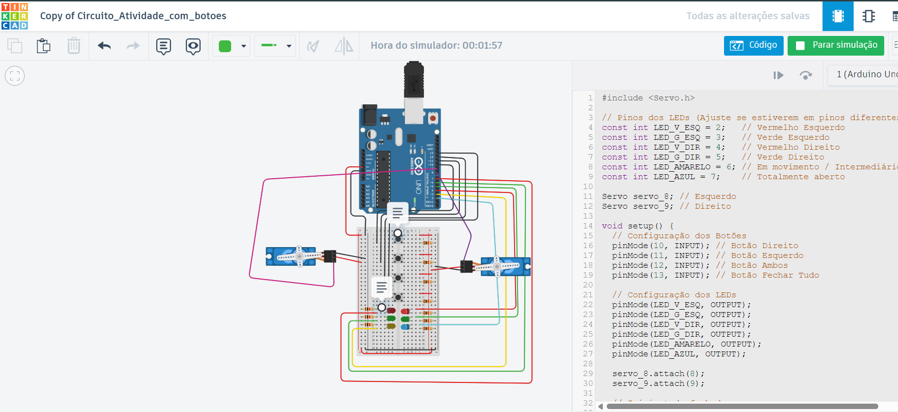
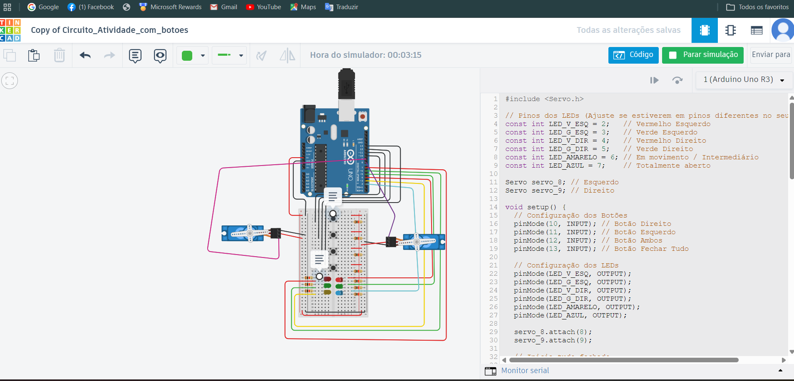
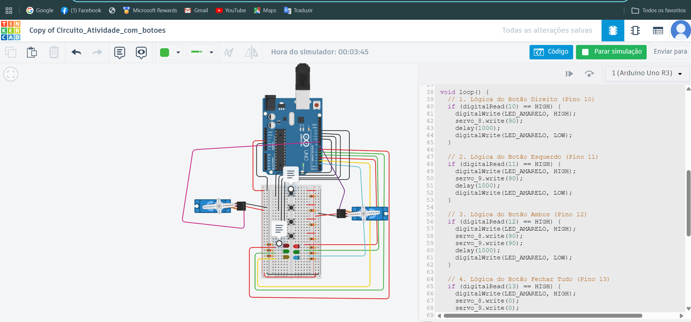
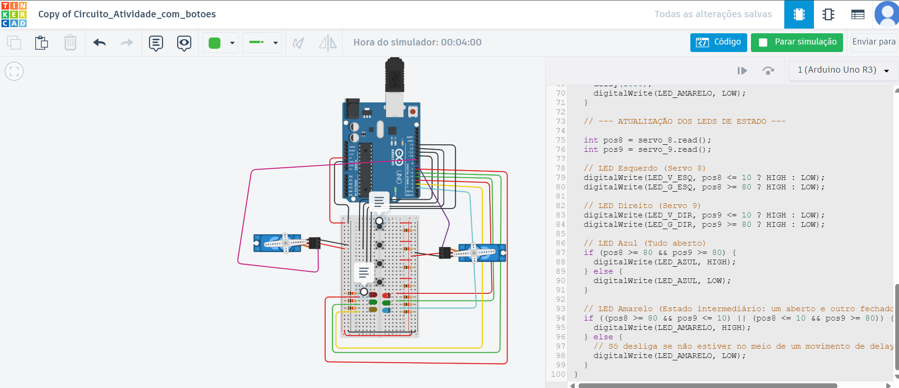

## 4. Montagem do Circuito

Aqui está a captura de tela do circuito montado no Tinkercad:

---

## 5. Print do Código

Abaixo, a captura da lógica implementada:

> **Nota:** O código-fonte completo também pode ser encontrado no arquivo `projeto.ino` deste repositório.
  
